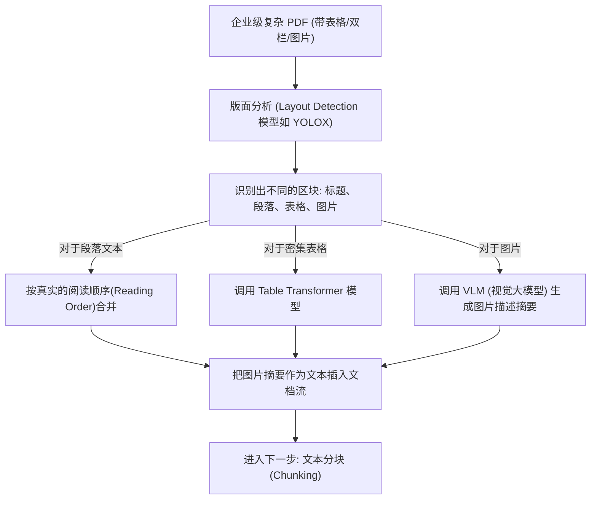
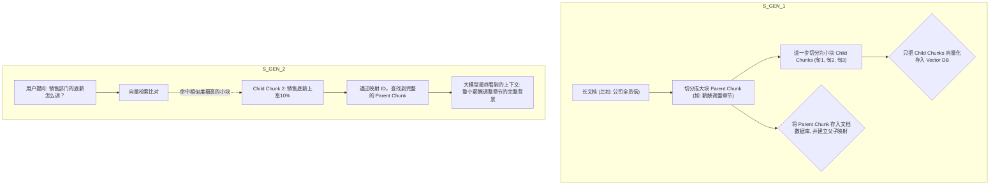

# 深度精讲 2.1：突破 RAG 瓶颈 —— 多模态文档解析与高级分块策略 (Chunking)

> **学习目标**：彻底明白为什么你的 RAG 答非所问，并掌握使用版面分析还原复杂 PDF，以及运用层级分块 (Hierarchical Chunking) 解决上下文割裂的架构设计。

---

## 1. 为什么“基础版 RAG”到了企业里就成了玩具？

很多人用 LangChain 的 `PyPDFLoader` 加上 `RecursiveCharacterTextSplitter` 凑一个 Demo，觉得 RAG 很简单。但一旦把企业里的真实研报（包含双栏排版、密集表格、图片、页眉页脚）喂进去，检索的准确率就会断崖式下跌。

**核心痛点 1：解析灾难 (Garbage In, Garbage Out)**
- **跨栏阅读**：两栏排版的 PDF，基础解析器会横着读（把左边一栏的半句话和右边一栏的半句话拼在一起），导致语义完全破坏。
- **表格丢失**：财报里的核心数据全在表格里，普通解析器把表格读成了一堆没有换行的乱码数字。

**核心痛点 2：上下文割裂 (Context Fragmentation)**
- 把一篇文章硬生生按 500 个字切一块。如果第 501 个字刚好是一个关键的代词“它”，大模型在单独拿到这一块时，根本不知道“它”指代什么。
- 切得太小，大模型看不见全局（缺乏上下文）；切得太大，找出来的噪音太多，大模型会看花眼。

---

## 2. 破局之道一：多模态文档解析与版面分析 (Layout Analysis)

高级 RAG 系统的第一步不是向量化，而是**把非结构化的 PDF 变成高度结构化的 Markdown 格式**。

### 2.1 OCR 与版面分析的工程架构
使用专业的解析引擎（如 **Unstructured.io**，或者开源的 **Marker**，阿里 **Qwen-VL** 等多模态大模型）。

> **架构图解：多模态文档解析流水线**



**工程实现提示**：
对于表格数据，大模型理解 Markdown 格式（`| 列1 | 列2 |`）的能力远远超过理解扁平化的字符串。对于包含极高密度财务数据的表格，甚至可以直接抽取存入 SQL 数据库，并在 RAG 中结合 Text2SQL 方案进行混合调用。

---

## 3. 破局之道二：高阶分块策略 (Advanced Chunking)

有了结构化的 Markdown，怎么切块？我们要抛弃无脑的按字数切分（Fixed-size Chunking），转向**语义分块**与**层级分块**。

### 3.1 语义分块 (Semantic Chunking) 理念
大意是：根据句子的意思来切。如果前一句话和后一句话的语义向量（Embedding）距离突然变大，说明这两句话讲的不是同一个话题，就在这里“切一刀”。

### 3.2 层级分块 (Hierarchical Chunking) / 父子块映射设计模式
这是目前工业界解决“上下文割裂”最主流、最优雅的设计模式（在 LlamaIndex 中被称为 `AutoMergingRetriever` 或 `Parent-Child Node` 模式）。

**设计理念：**
1. **小块负责“精准命中”**：把文档切得很细（比如每块一句话或一段话），用于 Embedding 和向量检索。因为越短的句子，其向量表示越聚焦，越容易被搜到。
2. **大块负责“提供语境”**：把小块原本所属的大段落（Parent Node）也存起来。
3. **当某个小块被检索命中时，我们不把小块喂给大模型，而是顺藤摸瓜找到它所属的父节点大块，把整个大块送给大模型**。

> **架构图解：层级分块与父节点召回机制**



### 3.3 实操练习与伪代码演示：层级分块的逻辑实现

我们用通俗的 Python 伪代码来展示层级分块的底层逻辑：

```python
# 假设这是我们的文档数据库和向量数据库
doc_db = {}     # 存 Parent Chunks (ID -> 文本内容)
vector_db = []  # 存 Child Chunks 向量 (向量, Parent_ID)

def index_hierarchical_chunks(document_text):
    # 1. 切出大块 (按段落或章节)
    parent_chunks = split_into_large_blocks(document_text)
    
    for p_idx, parent_text in enumerate(parent_chunks):
        parent_id = f"parent_{p_idx}"
        # 将大块原文存入文档库
        doc_db[parent_id] = parent_text 
        
        # 2. 从当前大块中切出小句子
        child_sentences = split_into_sentences(parent_text)
        
        for sentence in child_sentences:
            # 3. 只给小句子算 Embedding
            sentence_vector = compute_embedding(sentence)
            # 存入向量库，并死死绑定它的“父亲是谁”
            vector_db.append({
                "vector": sentence_vector,
                "text": sentence,
                "parent_id": parent_id
            })
            
def retrieve_and_generate(user_query):
    query_vector = compute_embedding(user_query)
    
    # 1. 向量比对，找到最匹配的 3 个“小句子”
    top_3_children = vector_search(query_vector, vector_db, k=3)
    
    context_to_llm = []
    # 2. 顺藤摸瓜，把这 3 个小句子对应的【老父亲】揪出来
    for child in top_3_children:
        parent_id = child["parent_id"]
        parent_full_text = doc_db[parent_id]
        
        # 为了避免重复，去重后拼接到上下文里
        if parent_full_text not in context_to_llm:
            context_to_llm.append(parent_full_text)
            
    # 3. 将完整的大段落上下文喂给 LLM
    final_answer = call_llm(user_query, context_to_llm)
    return final_answer
```

**效果总结**：
如果用户问“销售底薪涨了多少？”，向量检索瞬间锁定了含有“销售底薪”四个字的小块。但在回答时，大模型拿到的是包含“由于公司一季度业绩暴涨，为了激励员工，销售底薪上涨10%”这一完整前因后果的大段落。大模型再也不会出现“断章取义”的幻觉了！
