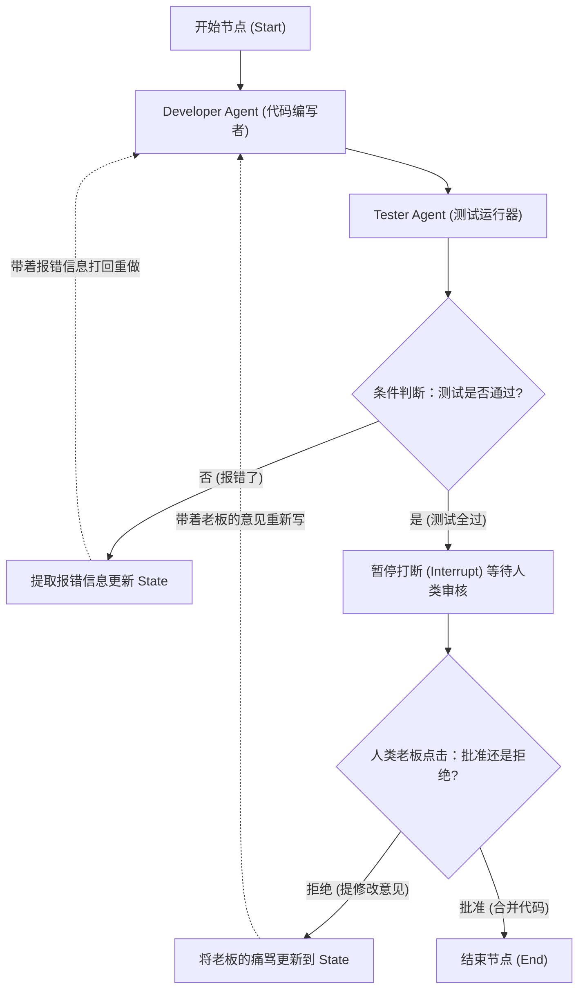

# 深度精讲 3.2：多智能体 (Multi-Agent) 协同与 LangGraph 复杂状态机编排

> **学习目标**：彻底告别简单的线性调用（Chain），掌握如何用有向图 (Graph) 建模复杂的业务工作流，并学会让多个具有不同技能 (Skills) 的 Agent 互相辩论、协作与移交任务。

---

## 1. 为什么“链式调用 (Chain)”搞不定真实业务？

在传统的 LangChain 应用中，我们通常把任务串成一条直线（Chain）：
`提问 -> 查知识库 -> 总结回答`。

但在真实的软件开发、商业分析等场景中，流程是**非线性的**，充满了：
- **循环 (Loops)**：代码写错了？退回去重新写。
- **条件分支 (Branches)**：如果是前端问题，交给前端 Agent；如果是后端问题，交给后端 Agent。
- **人工干预 (Human-in-the-loop)**：在发布到生产环境前，必须暂停整个流程，等真实人类点击“批准”按钮。

**破局方案：引入状态机 (State Machine) 与图模型 (Graph)。**
这就是 **LangGraph** 框架诞生的初衷。它允许你将 Agent 的执行过程建模为一个包含节点（Nodes）和边（Edges）的有向循环图。

---

## 2. Multi-Agent 的经典协作架构模式

当单兵作战能力（单个 Agent + 几个 Skills）达到上限时，我们自然需要引入团队作战（Multi-Agent）。目前工业界有几种成熟的多智能体协同模式：

### 2.1 Supervisor-Worker (主管-员工模式)
- **原理**：设立一个“主管 Agent (Supervisor)”，它本身没有干活的技能 (Skills)，它的唯一任务是“理解用户的 Instruction，并将任务拆解分发给底下的工人 Agent”。当工人干完活，主管负责验收并整合结果。
- **适用场景**：任务边界清晰的流水线作业（如：让搜索 Agent 去查资料，让代码 Agent 去写脚本，让制图 Agent 去画图）。

### 2.2 Peer-to-Peer Debate (群聊辩论模式)
- **原理**：把多个具有强迫症级别不同人设（Persona）的 Agent 扔进一个群聊里。比如一个“极致的代码极客”和一个“极其严苛的安全审计员”。他们对同一个问题提出方案并互相指出漏洞，直到达成共识。
- **适用场景**：高风险决策、安全审计、复杂方案设计。

---

## 3. 核心技术精讲：LangGraph 的底层逻辑与状态管理 (State)

在 LangGraph 中，所有的节点（Node）通过修改一个**全局的共享状态 (State)** 来进行通信。这就像车间流水线上的那条传送带，每个工人（Agent）都可以从传送带上拿东西看，干完活再把结果放回传送带上。

> **架构流转图：基于 LangGraph 的“开发-测试-人工审核”循环流**



---

## 4. 实操代码剖析：如何用 LangGraph 定义一个多节点循环工作流

```python
from typing import TypedDict, Annotated, List
import operator
from langgraph.graph import StateGraph, END

# ---------------------------------------------------------
# 1. 定义全局的 State (状态黑板)
# 所有 Agent 都能看到这个字典里的内容
# ---------------------------------------------------------
class ProjectState(TypedDict):
    task_instruction: str
    current_code: str
    test_logs: str
    review_comments: List[str]

# ---------------------------------------------------------
# 2. 定义节点 Nodes (每个节点可以是一个复杂的 Agent，或者纯 Python 函数)
# ---------------------------------------------------------
def developer_node(state: ProjectState):
    """Developer Agent: 负责根据任务和历史意见写代码"""
    print("👨‍💻 Developer: 正在拼命写代码...")
    # 这里实际上会调用带有 LLM 和 Coding Skill 的 Agent
    new_code = "def hello(): print('world')"
    return {"current_code": new_code} # 返回的结果会自动更新（合并）到全局 State 里

def tester_node(state: ProjectState):
    """Tester Agent: 负责执行代码并返回日志"""
    print("🕵️‍♂️ Tester: 正在沙盒里跑测试...")
    # 调用执行代码的 Skill
    # 为了演示，我们假装第一次测试失败了
    return {"test_logs": "Error: NameError name 'world' is not defined"}

# ---------------------------------------------------------
# 3. 定义条件边 Conditional Edges (图的路由逻辑)
# ---------------------------------------------------------
def should_continue_routing(state: ProjectState):
    """这是一个纯逻辑函数，判断下一步该去哪"""
    if "Error" in state["test_logs"]:
        print("🚦 路由系统: 测试失败！代码打回给 Developer 重写！")
        return "developer"
    else:
        print("🚦 路由系统: 测试通过！进入等待发布流程。")
        return "end"

# ---------------------------------------------------------
# 4. 把一切编排成图 (Graph)
# ---------------------------------------------------------
workflow = StateGraph(ProjectState)

# 把工人添加进车间
workflow.add_node("developer", developer_node)
workflow.add_node("tester", tester_node)

# 定义流水线的起始点
workflow.set_entry_point("developer")

# 写完代码后，无条件交给测试员
workflow.add_edge("developer", "tester")

# 测试完后，根据条件决定是打回重做，还是结束流程
workflow.add_conditional_edges(
    "tester",
    should_continue_routing,
    {
        "developer": "developer", # 如果路由返回 "developer"，就跳转到 developer 节点
        "end": END               # 如果返回 "end"，就结束
    }
)

# 编译成可执行的程序 (相当于图初始化)
# 这里还可以接入 Checkpointer (如 SQLite) 来支持状态持久化和断点续传
app = workflow.compile()
```

**效果总结：**
有了这个机制，我们就再也不用在外部写丑陋的 `while` 循环和满天飞的 `if-else` 来控制大模型了。
一切都被清晰地抽象成了**节点行为**和**边流转规则**。而且由于 State 的存在，这个流程即便是运行到一半服务器断电了，下次重启也能从上一个节点完美恢复执行。

接下来，我们将进入 **模块三的大练习：基于 LangGraph 构建虚拟软件开发公司**，让你亲自手写一套 Supervisor 带着几个员工干活的全功能代码！
