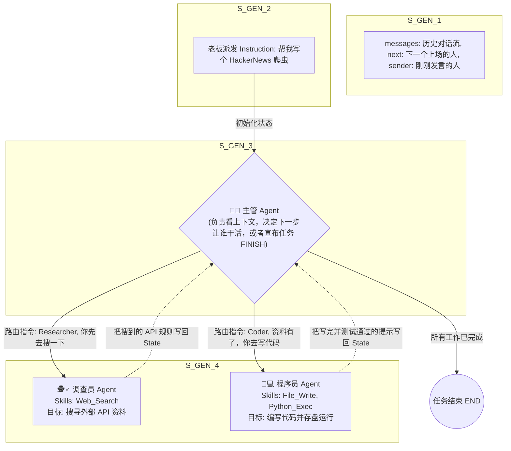

# 模块三综合大练习：构建虚拟软件研发团队 (LangGraph Supervisor Multi-Agent)

> **练习目标**：融汇“Agent、Skill、Instruction、Prompt 核心概念体系”与“LangGraph 多智能体图状态机编排”，从零搭建一个微缩版的虚拟软件开发公司。在这个公司里，老板派发需求（Instruction），主管（Supervisor）分发任务，开发（Dev）和测试（Tester）Agent 各带技能（Skills）协同打工。

---

## 1. 业务场景与架构设计挑战

**挑战场景**：
我们希望把一段粗糙的需求：“帮我用 Python 写个爬取 HackerNews 热榜的脚本并存入 CSV”，直接扔给咱们构建的多智能体系统。
- 系统内部有一个 **Supervisor (主管)**，负责判断当前该让谁上场干活。
- 有一个 **Researcher Agent (调查员)**，挂载了 Web Search Skill，负责去搜怎么爬 HackerNews 的 API 接口规则。
- 有一个 **Coder Agent (程序员)**，挂载了 File Write/Edit Skill，负责根据调查员的报告，在本地硬盘上把 Python 代码写出来并存盘。

### 1.1 融汇知识点架构图

> **架构流转图：Supervisor 模式下的 Multi-Agent 状态机编排**



---

## 2. 核心代码实战：基于 LangGraph 的多智能体协作

在这个实战中，我们将使用 LangChain 和 LangGraph 来快速构建带有 Skills 的 Agent，并用 Graph 编排它们。

### 2.1 环境准备
```bash
pip install langgraph langchain langchain-openai langchain-community
# 配置你的 OpenAI 或 vLLM 私有服务密钥
```

### 2.2 实操代码实现 (Python 核心逻辑骨架)

```python
import operator
from typing import Annotated, Sequence, TypedDict
from langchain_openai import ChatOpenAI
from langchain_core.messages import BaseMessage, HumanMessage
from langchain_core.prompts import ChatPromptTemplate, MessagesPlaceholder
from langgraph.graph import StateGraph, END
from langchain.agents import AgentExecutor, create_openai_tools_agent

# =========================================================
# 知识点 1: 定义全局共享状态 (State)
# =========================================================
# 这里的 messages 列表会不断累加所有 Agent 的发言和工具调用结果
class AgentState(TypedDict):
    messages: Annotated[Sequence[BaseMessage], operator.add]
    next: str  # 记录 Supervisor 决定的下一个上场节点名


# =========================================================
# 知识点 2: 定义 Skills (工具库) 与 Function Calling 机制
# 这里的 @tool 装饰器底层做的事情：自动把 Python 函数的类型注解（如 `query: str`）和 docstring 
# 转换成了 OpenAI 的 JSON Schema！然后附带在 Prompt 里发送。大模型在返回时，
# 会停止输出自然语言，而是返回一个包含 `name: "web_search"` 的 JSON 格式结构。
# 
# 进阶思考 (MCP 协议化)：
# 如果你使用了 MCP 架构，那么下面这两个函数就不需要写在 Agent 的代码里了。
# 你可以单独起一个 MCP Server，让 Agent 客户端直接通过 STDIO 或 SSE 连接，获取这两个能力！
# =========================================================

from langchain_core.tools import tool

@tool("web_search")
def web_search_skill(query: str) -> str:
    """用于在互联网上搜索最新资料的技能。"""
    # ... 发起搜索请求 ...
    return "HackerNews API 的顶级接口是 https://hacker-news.firebaseio.com/v0/topstories.json"

@tool("write_file")
def write_file_skill(filename: str, code: str) -> str:
    """用于将代码写入本地硬盘的技能。"""
    with open(filename, "w") as f:
        f.write(code)
    return f"代码已成功写入 {filename}"

# =========================================================
# 知识点 3: 构建各个 Agent 实体 (大脑 + 人设 Prompt + Skills)
# =========================================================
llm = ChatOpenAI(model="gpt-4o-mini", temperature=0)

# 创建调查员 Agent
researcher_prompt = ChatPromptTemplate.from_messages([
    ("system", "你是一个资深技术调查员。请使用 web_search 技能查阅开发所需的 API 资料。不要自己写代码。"),
    MessagesPlaceholder(variable_name="messages"),
    MessagesPlaceholder(variable_name="agent_scratchpad"),
])
researcher_agent = create_openai_tools_agent(llm, [web_search_skill], researcher_prompt)
researcher_executor = AgentExecutor(agent=researcher_agent, tools=[web_search_skill])

# 创建程序员 Agent
coder_prompt = ChatPromptTemplate.from_messages([
    ("system", "你是一个高级 Python 开发。根据上下文里的资料写代码，并使用 write_file 技能将代码保存。"),
    MessagesPlaceholder(variable_name="messages"),
    MessagesPlaceholder(variable_name="agent_scratchpad"),
])
coder_agent = create_openai_tools_agent(llm, [write_file_skill], coder_prompt)
coder_executor = AgentExecutor(agent=coder_agent, tools=[write_file_skill])

# =========================================================
# 知识点 4: 构建 Supervisor (主管路由器)
# =========================================================
members = ["Researcher", "Coder"]
system_prompt = (
    "你是一个工作流调度主管。以下工人归你管辖：{members}。"
    "仔细阅读当前的对话历史，并决定下一步让谁干活。当所有任务完成时，输出 FINISH。"
)
# Supervisor 只需要一个选择题 Prompt，不需要具体的 Skills
options = ["FINISH"] + members
# 构建一个让 LLM 从 options 里做选择的专用函数 (此处省略具体的结构化输出解析逻辑)

def supervisor_node(state: AgentState):
    print("\\n👨‍💼 Supervisor: 正在视察工作进度，决定下一步派活...")
    # LLM 分析 state["messages"]，返回下一个上场的人，比如 "Researcher"
    # return {"next": decision} 
    pass 

# =========================================================
# 知识点 5: 用 LangGraph 将团队编排成有向图
# =========================================================
def researcher_node(state: AgentState):
    print("\\n🕵️‍♂️ Researcher: 接到任务，开始搜索资料...")
    result = researcher_executor.invoke({"messages": state["messages"]})
    # 把自己的工作汇报追加到消息队列里
    return {"messages": [HumanMessage(content=result["output"], name="Researcher")]}

def coder_node(state: AgentState):
    print("\\n👨‍💻 Coder: 拿到资料，开始疯狂敲代码并写入文件...")
    result = coder_executor.invoke({"messages": state["messages"]})
    return {"messages": [HumanMessage(content=result["output"], name="Coder")]}

# 初始化图结构
workflow = StateGraph(AgentState)

# 录入节点
workflow.add_node("Researcher", researcher_node)
workflow.add_node("Coder", coder_node)
workflow.add_node("supervisor", supervisor_node)

# 定义所有的工人在干完活之后，都必须向主管汇报 (流转回 Supervisor)
workflow.add_edge("Researcher", "supervisor")
workflow.add_edge("Coder", "supervisor")

# 定义条件边：主管说让谁上，流程就指向谁
workflow.add_conditional_edges(
    "supervisor",
    lambda state: state["next"],
    {
        "Researcher": "Researcher",
        "Coder": "Coder",
        "FINISH": END
    }
)

# 主管永远是第一个上场的 (接活)
workflow.set_entry_point("supervisor")

# 编译应用
app = workflow.compile()

# =========================================================
# 运行主程序测试
# =========================================================
if __name__ == "__main__":
    initial_instruction = "写一个抓取 HackerNews 头条新闻的 Python 脚本，保存为 hn_scraper.py"
    print(f"🚀 老板派发任务: {initial_instruction}")
    
    # 将老板的初始 Instruction 塞入起始 State，启动整个虚拟公司流转
    app.invoke({
        "messages": [HumanMessage(content=initial_instruction)],
        "next": "supervisor"
    })
```


## 3. 实操交付物验收标准
当你在终端运行这份完整架构的代码时，你需要观察和验收以下流转日志：
1. **主管首次派活**：Supervisor 读取了你的需求，发现需要查 HackerNews API，于是把 `next` 设置为了 `Researcher`。
2. **Function Calling (技能调用) 与传参**：Researcher 被唤醒，它脑子里闪过了自己的 `web_search_skill` JSON Schema。它停止说废话，转而输出了一个 **Tool Call (函数调用) 请求**。你会在后台日志看到大模型吐出了精确的参数（如 `{"query": "HackerNews API URL"}`）。
3. **状态黑板的传递**：本地框架拦截了这个 Tool Call，在你的电脑上真实地发起了网络请求。Researcher 拿到返回的真实文本后，将结果汇报在 State 记录里，流程打回给 Supervisor。Supervisor 看了觉得可以了，于是把活派给 `Coder`。
4. **代码落盘验证**：Coder 读取了前面的 API 资料（State 中的 Memory 上下文），生成了正确的请求代码，并输出了调用 `write_file_skill` 的 JSON 参数。本地框架拦截执行后，你在目录下立刻发现多出了一个可运行的 `hn_scraper.py` 文件。
5. **任务闭环**：Supervisor 再次视察，发现代码已经写入完毕，任务达成，直接宣布 `FINISH`，程序优雅退出。

> **模块三综合总结**：通过将底层组件（Agent/Skill/Prompt）、底层调用机制（Function Calling / 未来的 MCP 协议）与顶层架构编排（LangGraph/状态黑板）完美融合，我们不仅写出了自动化脚本，更是在代码里经营了一家高运转效能的**虚拟极客公司**。这，就是大模型时代顶尖应用架构师的必修课！
