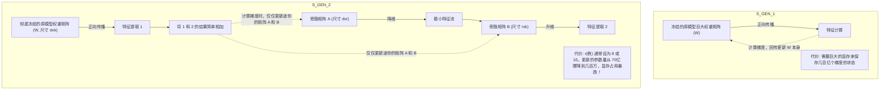

# 深度精讲 4.1：从炼丹到起飞 —— 为什么微调，何时微调，以及 LoRA 原理透析

> **学习目标**：掌握大模型生命周期的后半程，理清 Prompt Engineering、RAG 与 Fine-Tuning 的能力边界，并深入理解单卡微调百亿参数模型的神器：LoRA。

---

## 1. 灵魂拷问：既然有 RAG，我为什么还要微调 (Fine-Tuning)?

在构建企业级 AI 应用时，最常见的误区就是“拿到一个开源模型，先跑个微调再说”。

**高级架构师的决策树**：
- 如果你需要模型知道**新知识**（比如公司昨天的财报、某款刚发布的产品参数）👉 **绝对不要微调！使用 RAG！** 模型在权重中记忆事实的效率极低，而且无法实时更新，微调很容易导致严重的幻觉。
- 如果你需要模型掌握**新能力或新格式**（比如让它学会怎么把自然语言翻译成你们公司独有的、复杂的 JSON 结构；或者让它像一个阴阳怪气的客服一样说话）👉 **这才是微调（SFT）的舞台。**

**总结**：RAG 给大脑外接了一块“硬盘”（知识），而微调是给大脑做“脑前额叶手术”（行为模式、语气、格式控制）。

---

## 2. 监督微调 (Supervised Fine-Tuning, SFT) 的数据飞轮

微调的核心不是算力，而是**数据**（Data is all you need）。

### 2.1 SFT 数据的格式
你需要准备成千上万个 `(Instruction, Input, Output)` 或者 `(User, Assistant)` 的对话对。
```json
[
  {
    "instruction": "分析用户对该手机的评价情感。",
    "input": "电池续航太差了，但屏幕很漂亮。",
    "output": "情感倾向：褒贬不一。\n负面实体：电池续航。\n正面实体：屏幕。"
  }
]
```
当模型在这样的数据上训练了足够多轮（Epochs）后，它遇到类似的指令时，就会不自觉地按照你的 `Output` 模板去吐字。

### 2.2 建立数据飞轮 (Data Flywheel) 架构设计
- **冷启动**：最开始没有数据怎么办？使用 GPT-4 或 Claude-3.5 跑 RAG 流程，把人类专家觉得非常满意的回答（包含 Prompt 和 Output）抓取下来，作为初始微调数据集（这叫**知识蒸馏**）。
- **人工标注 (Human-in-the-loop)**：上线后，收集用户点赞（👍）和点踩（👎）的日志。点踩的日志交给人工审核，修正出完美答案后，加入 SFT 数据池。
- **重新炼丹**：每积累 1000 条高质量新数据，就在后台触发一次增量微调任务，模型越来越聪明。

---

## 3. 解密单卡微调百亿模型的神器：LoRA (Low-Rank Adaptation) 原理

早期，要微调一个 7B（70亿参数）的模型，所有的参数矩阵都要参与梯度更新，光显存就需要上百 GB（全参微调 Full Fine-Tuning）。
微软发明的 **LoRA** 彻底改变了游戏规则。

### 3.1 LoRA 的数学直觉：低秩旁路矩阵

> **架构图解：LoRA 微调的底层逻辑**



### 3.2 LoRA 的工程优势
- **极省显存**：配合 4-bit 量化（这就是 **QLoRA**），你可以在一张 24G 显存的 RTX 3090 / 4090 上轻松微调 8B 模型。
- **即插即用 (Adapter 机制)**：你训练出来的东西不再是一个几十 GB 的完整新模型，而是一个只有几十 MB 的“补丁包”（LoRA Adapter）。你可以为“财务机器人”练一个 Adapter，为“代码机器人”练另一个。推理时，底座大模型不变，给它挂上哪套 Adapter，它就瞬间变成那个专家！

---

## 4. 实操代码剖析：如何用 LLaMA-Factory 跑通全链路

**最佳实践**：高级工程师绝对不会自己从头去写 PyTorch 的分布式训练代码（比如 Deepspeed 或是 Accelerate）。工业界目前最顶级的开源微调脚手架是 **LLaMA-Factory**。

### 4.1 使用 LLaMA-Factory 进行一键式 QLoRA 微调

```bash
# 1. 准备你的数据集 custom_dataset.json，并注册进 LLaMA-Factory 的 dataset_info.json 里。

# 2. 启动命令行训练 (这段脚本定义了模型在哪里、数据集是什么、如何做 LoRA)
llamafactory-cli train \
    --stage sft \
    --do_train \
    --model_name_or_path Qwen/Qwen2.5-7B-Instruct \
    --dataset custom_dataset \
    --dataset_dir ./data \
    --template qwen \
    --finetuning_type lora \
    --lora_target q_proj,v_proj \  # 针对 Transformer 的 Q 和 V 注意力矩阵挂载旁路
    --lora_rank 16 \               # 矩阵降维到 16，极大地压缩参数
    --output_dir ./saves/qwen-7b/lora/sft \
    --overwrite_cache \
    --per_device_train_batch_size 2 \
    --gradient_accumulation_steps 4 \
    --lr_scheduler_type cosine \
    --logging_steps 10 \
    --save_steps 500 \
    --learning_rate 5e-5 \
    --num_train_epochs 3.0 \
    --plot_loss \
    --fp16                         # 开启半精度节省显存
```

运行完后，你就会在 `./saves/qwen-7b/lora/sft` 目录下拿到那份只有几十 MB 的 LoRA Adapter 权重！

> **阶段总结**：你现在已经知道为什么微调、何时微调，以及怎么用单卡廉价地进行微调了。但这只是把模型“炼”出来了。接下来，我们要讲如何把这个模型扔到线上，扛起每秒成百上千次的并发请求！进入下一节：vLLM 与 LLMOps。
