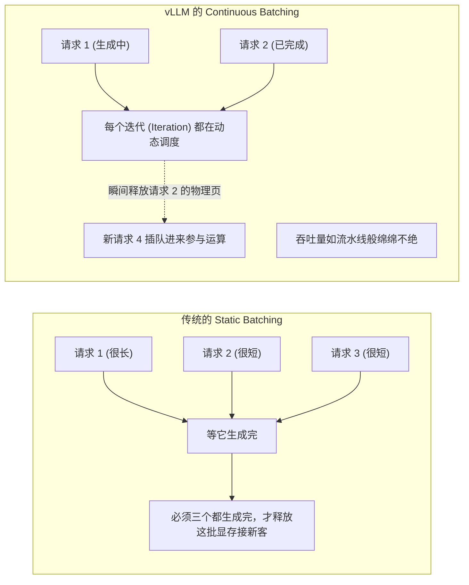

# 深度精讲 4.2：从实验室到双十一并发 —— vLLM 高性能部署与 LLMOps 全链路监控

> **学习目标**：理解并发推理面临的核心瓶颈，掌握 PagedAttention 机制，使用 vLLM 部署高可用大模型服务，并接入 Langfuse 进行完整的 LLMOps 链路追踪。

---

## 1. 为什么大模型推理慢得像蜗牛？

很多开发者在本地跑通了 HuggingFace 的 `pipeline()` 或是 `model.generate()`，觉得就大功告成了，结果一上线，10 个用户同时提问，服务器就彻底卡死，甚至 OOM (Out of Memory) 崩溃。

### 1.1 并发的噩梦：显存碎片与静态批处理
如我们在 1.1 节所讲，大模型生成极度依赖 **KV Cache**。
- 如果我们用传统方法，系统必须为每个请求提前预留最大可能上下文长度（比如 8K）的显存，以防生成到一半没地方放 KV Cache。
- 绝大多数请求的回答其实只有几百个 Token。那些预留但没用上的显存，就变成了巨大的“碎片”和“浪费”。
- 显存被碎片占满后，GPU 就无法同时处理（Batch）更多请求，吞吐量（QPS）断崖式下跌。

---

## 2. 吞吐量之王：vLLM 与 PagedAttention

由加州大学伯克利分校团队开发的 **vLLM** 框架，彻底颠覆了工业界。

### 2.1 PagedAttention 显存分页机制
vLLM 的核心理念借用了操作系统管理虚拟内存的智慧：
1. 它把连续的 KV Cache 切割成固定大小的“物理页 (Block)”，每个页比如只能装 16 个 Token 的 KV。
2. 用户的请求被映射为一个“逻辑内存空间”。随着文本逐字生成，只要逻辑空间需要新的 Token，vLLM 就动态分配一个新的物理页给它。
3. **结果**：显存浪费被控制在了极低的 4% 以内。GPU 省出了海量的显存去接收并发的新请求，整体吞吐量飙升了数倍！

> **架构图解：Continuous Batching (连续批处理)**



---

## 3. 实操代码剖析：使用 vLLM 部署私有模型 + LoRA 补丁

接下来，我们将使用 vLLM 部署我们上一节微调出来的基础模型加 LoRA 补丁，并对外暴露一套完全兼容 OpenAI SDK 的高速 API 接口。

### 3.1 启动 vLLM 并发推理引擎

```bash
# 在终端中运行这行神级命令
python -m vllm.entrypoints.openai.api_server \
    --model Qwen/Qwen2.5-7B-Instruct \
    --enable-lora \
    --lora-modules my_custom_lora=./saves/qwen-7b/lora/sft \
    --max-model-len 8192 \
    --gpu-memory-utilization 0.90 \
    --port 8000
```
*参数精讲*：
- `--enable-lora`：vLLM 原生支持动态加载 LoRA 补丁（无需提前与底座模型合并权重，这意味着同一个底座可以同时挂载多个微调补丁服务不同的请求！）。
- `--gpu-memory-utilization 0.90`：告诉 vLLM 上来就吃掉 90% 的显存用来划分布局 `PagedAttention` 的内存池。这是高吞吐的核心。

### 3.2 客户端调用（无缝替换 OpenAI 接口）
由于 vLLM 暴露了完全兼容的接口，应用层的代码不需要任何改变，直接把 `base_url` 改成本地即可享受极速推理。
```python
from openai import OpenAI

client = OpenAI(
    api_key="EMPTY",
    base_url="http://localhost:8000/v1"
)

# 注意我们要用挂载了 LoRA 的专用补丁名称
response = client.chat.completions.create(
    model="my_custom_lora", 
    messages=[{"role": "user", "content": "请用我们公司的客服口吻回答退货政策。"}]
)
print(response.choices[0].message.content)
```

---

## 4. LLMOps 全链路监控与追踪 (Tracing) 最佳实践

服务跑起来了，但如果一个带有复杂 RAG 和 Agent 调用的请求返回耗时高达 10 秒，你怎么知道是网络搜索慢了，还是大模型推理卡了？
高级工程师必须在应用层打满监控探针，这就是 **LLMOps (大语言模型运维)**。

### 4.1 Langfuse 可视化 Tracing
Langfuse 是目前首选的开源 LLMOps 平台。只需两行代码，你的 LangChain / LlamaIndex 甚至纯代码调用，都会被全程追踪并画出瀑布图（Waterfall）。

**实操代码演示：如何追踪一个 Agent 的流转**
```python
from langfuse.decorators import observe
from langfuse.openai import openai # 使用 langfuse 封装的 openai 客户端自动追踪

# 使用装饰器，Langfuse 就会记录这个函数的耗时和出入参
@observe()
def complex_agent_pipeline(user_query: str):
    # 第 1 步：检索知识库 (耗时追踪)
    context = retrieve_from_db(user_query)
    
    # 第 2 步：调用大模型 (Token 计费、耗时追踪)
    response = openai.chat.completions.create(
        model="gpt-4o-mini",
        messages=[
            {"role": "system", "content": f"基于以下背景回答：{context}"},
            {"role": "user", "content": user_query}
        ]
    )
    return response.choices[0].message.content

# 当函数执行完毕，你打开 Langfuse 面板，就能看到：
# - 整个 Pipeline 总耗时 2.5s，总花费 0.002 美元
# - 检索耗时 0.5s，大模型生成耗时 2.0s，生成了 150 个 Token
```

**工业级落地意义**：
只有掌握了 Tracing 追踪、Token 计费大盘、Prompt 版本 A/B 测试管理，你才敢拍着胸脯向老板保证：“我们的 AI 架构是稳健、低成本且可溯源的。”

---
> **尾声**：微调（LoRA）教模型“做人”，vLLM 为模型安上“心脏起搏器”，而 LLMOps (Langfuse) 为系统装上了“心电图监控”。高级 AI 工程师的闭环之路，到此大圆满。
