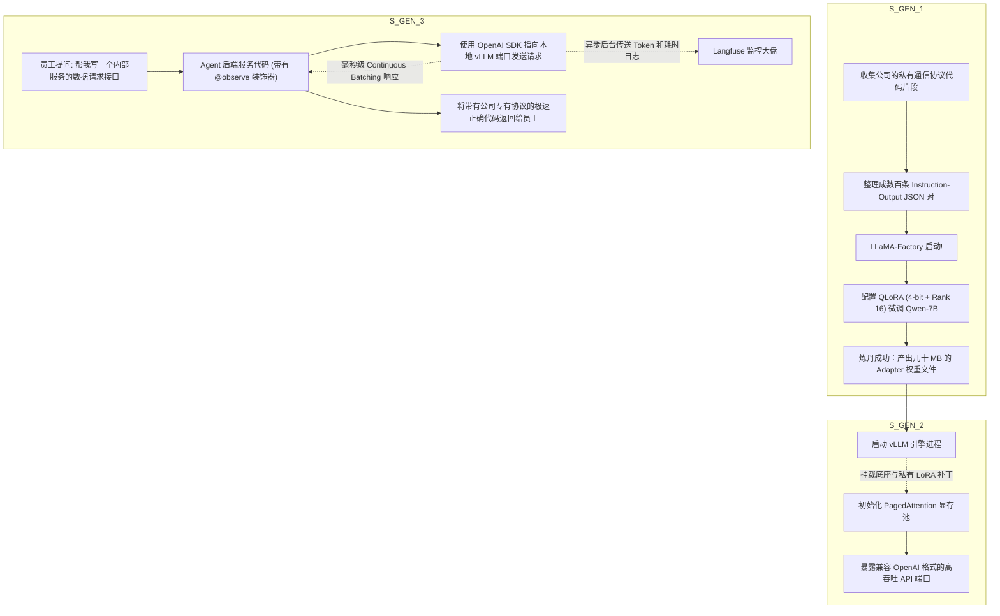

# 模块四综合大练习：企业级 AI 服务的微调、高并发上线与追踪闭环

> **练习目标**：在这场终局战役中，你将扮演从算法工程师到后端运维的“全栈架构师”。清洗业务数据、跑通 LoRA 微调、用 vLLM 起服务，最终使用压测工具打出漂亮的高 QPS 数据，并在监控大盘上捕获完美链路！

---

## 1. 业务场景与挑战

你的公司决定不调外部 API 了，要在本地的一张 RTX 4090 (24GB 显存) 上部署开源模型 `Qwen2.5-7B`，给全公司的 1000 名员工提供内部的“代码助手”服务。
- 但是，开源模型不懂你们公司独有的“加密内部通信协议框架”，经常生成错误的 API 请求。所以你要**微调它 (SFT/LoRA)**。
- 员工中午同时在使用时，请求挤爆了。所以你要用 **vLLM** 而不能用原生的 Transformers 库。
- 老板让你月底汇报：“这台机器一个月给我们省了多少 Token 费？”所以你要接入 **Langfuse (LLMOps)**。

### 1.1 终局架构图解

> **架构流转图：微调 -> 高性能部署 -> 生产级调用监控**



---

## 2. 压测与实战：交付物检验

为了证明你的架构不是花架子，你需要写一个小脚本来对 vLLM 服务进行压力测试，并跑通全链路。

### 2.1 Python 高并发压测脚本与追踪埋点 (实操代码)

```python
import asyncio
import time
from openai import AsyncOpenAI
from langfuse.decorators import observe

# ---------------------------------------------------------
# 1. 配置异步并发的本地大模型客户端
# ---------------------------------------------------------
client = AsyncOpenAI(
    api_key="EMPTY",  # 本地部署不需要 key
    base_url="http://localhost:8000/v1" # 这是你用 vLLM 拉起的私有模型端点
)

# ---------------------------------------------------------
# 2. 定义带追踪探针的单次推理请求
# ---------------------------------------------------------
@observe(name="generate_internal_code") # Langfuse 追踪注解
async def request_local_model(req_id: int):
    prompt = f"请求 ID {req_id}: 请用我们公司内部通信框架，写一段向支付网关发起 POST 的 Python 代码。"
    
    start_time = time.time()
    try:
        # 注意：这里的 model 要填你挂载的 LoRA 名称，大模型就会用微调后的脑子回答
        response = await client.chat.completions.create(
            model="internal_api_lora", 
            messages=[{"role": "user", "content": prompt}],
            max_tokens=200,
            temperature=0.1
        )
        latency = time.time() - start_time
        tokens = response.usage.completion_tokens
        
        print(f"[Req {req_id}] 完成! 耗时: {latency:.2f}s | 吐字: {tokens} | 速度: {tokens/latency:.1f} token/s")
        return tokens
    except Exception as e:
        print(f"[Req {req_id}] 崩溃: {e}")
        return 0

# ---------------------------------------------------------
# 3. 压测主控：一瞬间扔进去 50 个并发请求，看 vLLM 的表现！
# ---------------------------------------------------------
async def main():
    print("🚀 开始压力测试：同时发起 50 个大模型请求！(Continuous Batching 发威时刻)")
    start_all = time.time()
    
    # 构建 50 个并发任务
    tasks = [request_local_model(i) for i in range(1, 51)]
    
    # 异步等待所有任务完成
    results = await asyncio.gather(*tasks)
    
    total_time = time.time() - start_all
    total_tokens = sum(results)
    
    print("\\n=================================================")
    print(f"✅ 压测结束！总计处理 50 个并发请求。")
    print(f"⏱️ 全局总耗时：{total_time:.2f} 秒")
    print(f"📊 系统并发吞吐量 (QPS)：{50 / total_time:.2f} 请求/秒")
    print(f"🔥 系统总生成吞吐率：{total_tokens / total_time:.1f} Token/秒")
    print("=================================================")
    print("💡 现在，你可以去 Langfuse 大盘查看所有的链路日志和 Token 开销了！")

if __name__ == "__main__":
    asyncio.run(main())
```

## 3. 实操交付物验收标准
当你在有单卡 GPU 的服务器上完整跑完【模块四】，你需要观察并验收：
1. **LoRA 炼丹验证**：查看微调出来的文本输出，它是否不再使用原生的 requests 库，而是如你喂给它的数据集一样，老老实实写出了带有 `import company_private_http_client` 的私有框架代码。
2. **vLLM 降维打击的压测数据**：运行上面的并发测试脚本。如果你不用 vLLM 而是用 Transformers 的原生 `model.generate()`，50 个并发绝对会因为 OOM 把服务卡死，耗时至少几分钟；而 vLLM 应该能在短短十几秒内从容吞下并完成所有回答。
3. **LLMOps 大盘点亮**：登录 Langfuse 网页端，你能看到这 50 个请求化作了 50 条清晰的追踪日志（Trace）。点开任意一条，你都能看到用户提了什么、模型回了什么、生成耗时多少毫秒、花掉了多少 Token 的算力。

> **终局总结**：从读懂论文到底层原理，从 RAG 检索到多智能体大图编排，最后到大模型的极限微调压测与线上监控！至此，整套《高级 AI 应用工程师》实操大课圆满收官！你已经完全具备了主导企业级 AI 基建架构的宗师级战力。江湖路远，Keep Building！
